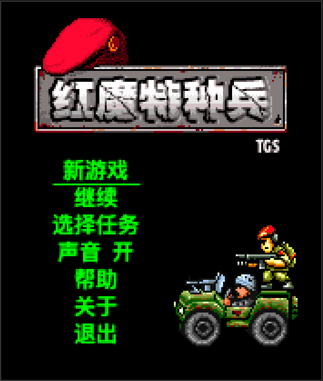
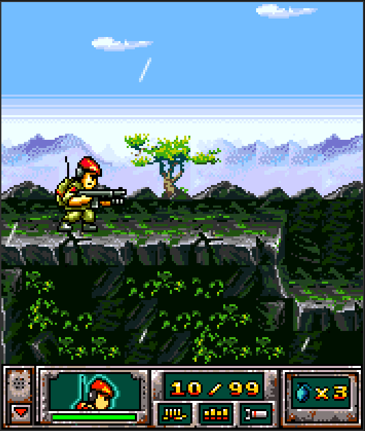

# 红魔特种兵 1 & 2 — 逆向复刻

把两款 2005 / 2006 年的功能机 J2ME 游戏搬进现代浏览器（TypeScript + HTML5 Canvas），直接就能玩。这是对自己持有的老游戏做的存档保护与再实现。

**🎮 在线试玩**：[游戏1 红魔特种兵](https://geeknull.github.io/red-devil-re/?game=1) · [游戏2 深海战舰](https://geeknull.github.io/red-devil-re/?game=2)

<p align="center">
  
  &nbsp;
  
</p>

|  | 游戏1 红魔特种兵 | 游戏2 深海战舰 |
|---|---|---|
| 发行 / 开发 | Sina / TGS | Sina |
| 目标机型 | Nokia N-Gage QD | Motorola E398 |

## 怎么做的

原版反编译后逐行翻成 TypeScript，跑在一套自己实现的 J2ME 兼容层上：

```
Web 运行壳 (Vite)
   ↓
游戏逻辑 (game1 / game2)    逐行对应反编译源
   ↓
J2ME 兼容层 (j2me-shim)     Random · Graphics · Image · Resource · Sound
```

## 快速开始

```bash
pnpm install
pnpm --filter @red-devil/web dev   # 打开 http://localhost:2005
```

`?game=1` 红魔特种兵 · `?game=2` 深海战舰，按键说明在页面右侧。

## 文档

设计、逆向、验证、移植规约、实现细节等完整文档都在 [`docs/`](docs/)。

## 许可

本仓库**未附带开源许可**：自有原创部分（代码 / 文档 / 脚本）保留权利；原版游戏 JAR、反编译产物与素材版权归原始权利人（Sina / TGS），仅作存档 / 研究收录。详见 [LICENSE](LICENSE)。
