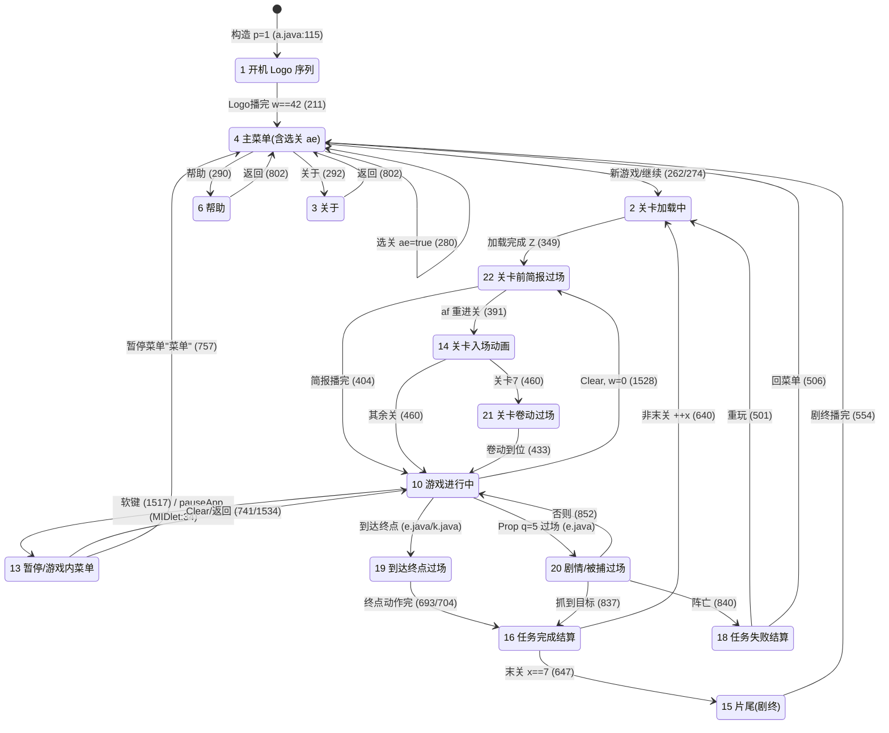

# 红魔特种兵（game1）— 游戏状态机

> 已据 CFR 恢复方法补全。

> 主状态变量为 `a.p`（`a.java:63`，CFR 行号）。全部基于源码，引用 `文件:行号`。
>
> ✅ **更新（CFR 已恢复 paint）**：`a.paint(Graphics var1_1)`（CFR `a.java:165-858`）此前 jadx 反编译失败，现已由 CFR 完整恢复。它是一个 `switch(this.p)` 的「每帧渲染 + 纯 UI 状态内按键导航」总入口；菜单/Logo/帮助/关于/胜负/过场等界面的绘制与状态转移**均驻留于此**。下方第 1/2 节已据此订正：原 jadx 阶段把 `p==1` 当作"主菜单族"、`p==4` 含义不明，**均有误**——真实情况见下。

> ⚠️ 注意 jadx 与 CFR 行号不同：原文档引用的 `a.java:144-150 paint`、`562 d()`、`571 a(int)`、`766-791 keyPressed`、`714-764 h(int)` 均为 jadx 行号；CFR 对应行号为 `paint=165`、`d()=1272`、`a(int)=1280`、`keyPressed=1514`、`h(int)=1446`。本节新增内容统一引用 **CFR 行号**。

## 1. `a.p` 取值枚举（已据 CFR paint 全量确证）

CFR 恢复的 `paint()`（`a.java:165-858`）顶层为 `switch(this.p)`，覆盖了全部 14 个状态。下表按 case 顺序列出，纯 UI 状态注明其「绘制内容 + 界面内按键导航」：

| `p` | 含义 | paint 中的 case / 关键行 |
|---|---|---|
| `1` | **开机 Logo 序列**（初始）：由 `w` 计数分帧播 4 张图——`w==0` 发行商 logo `f(8)` + "移动互连 无限可能"；`w==12` "新浪无线代理发行"；`w==22` `f(1)` + "www.tickgame.com"；`w∈(32,42)` 像素渐显动画；`w==42` 收尾 | case 1（`a.java:170-221`）；`w==0` 内调 `d()` 初始化（179） |
| `4` | **主菜单**（非"某子界面"，是真正的主菜单）：黑底 + 标题图 `i=f(2)`，逐条画 `GameMIDlet.e[]`，光标行画下划线、闪烁高亮。`ae=true` 时切到内嵌的**选择任务**子界面（画"任务X"+边框） | case 4（`a.java:222-346`） |
| `2` | **关卡加载中**：每帧调 `a(this.x)` 推进加载机 `w:0→9`，画"载入中 ..."逐点动画；加载完成（`Z==true`）→ `p=22` | case 2（`a.java:347-363`） |
| `22` | **关卡前剧情简报过场**：`w:0→70` 播 `b(g,w)` 角色对话动画（"总部呼叫红帽" / 关卡2"敌人绑架了化学专家" / 关卡4"敌人制造了巨型炸弹"），结束按 `af`/`x` 转 `p=10` 或 `p=14` | case 22（`a.java:364-409`） |
| `21` | **关卡卷动过场**（仅关卡 `x==2`/`x==7`）：脚本化推相机 `t`，到位后回 `p=10`；与玩法共用 `a()`+`a(Graphics)` 绘制 | case 21（`a.java:410-449`） |
| `14` | **关卡入场动画**（`af==true` 即重新进关时）：`w:0→16` 播玩家入场动作 `j.a(...)`，结束转 `p=21`（关卡7）或 `p=10` | case 14（`a.java:450-466`） |
| `10` | **关卡内·游戏进行中**（主玩法）：`a()` 更新世界 + `a(Graphics)` 绘制场景与 HUD | case 10（`a.java:469-473`）；HUD 闪烁 `p==10`（981） |
| `18` | **任务失败结算**：画"任务X失败 / 击毙敌人:N / 所用时间:T" + 2 项菜单（`e[1]继续`、`e[9]菜单`），上下选/确定：0→重玩 `p=2`，1→回主菜单 `p=4` | case 18（`a.java:474-538`） |
| `15` | **片尾"剧终"**（通关全部关卡后）：`ak/al` 卷动结尾画面，`ak>240` 显示"剧终"，倒计完 → `p=4` | case 15（`a.java:539-612`） |
| `16` | **任务完成结算**：画"任务X完成 / 击毙敌人 / 所用时间" + 过关动画；非末关 `++x; p=2`（进下一关加载），末关（`x==7`）→ `p=15`（片尾） | case 16（`a.java:613-656`） |
| `19` | **通关/到达终点过场**：按关卡 `x` 播玩家终点动作（开门/升降等），相机推进到关末后 → `p=16`（结算） | case 19（`a.java:657-721`） |
| `13` | **暂停 / 游戏内菜单**：半透明面板 + 4 项（`e[8]返回游戏`、声音开/关、`e[9]菜单`、`e[6]退出`），上下选/确定 | case 13（`a.java:722-799`） |
| `3` / `6` | **关于 / 帮助**（文本分页）：`p==6` 走 `g(0)` 帮助脚本、`p==3` 走 `g(1)` 关于脚本，画标题文本后 `c(Graphics)` 逐页滚动；按返回（`q!=0`）→ `p=4` | case 3/6（`a.java:800-827`） |
| `20` | **剧情/被捕过场**：`w:0→12` 播一段动画，结束按结果分流——抓到目标且坐标命中 → `p=16`（完成）；玩家阵亡 `j.e<=0` → `p=18`（失败）；否则回 `p=10` | case 20（`a.java:828-853`） |

> 子状态/标志：选择任务界面靠 `ae`（case 4 内 `a.java:228-311`）；菜单光标用 `y`(当前项)/`H`(显示行)/`G`(高亮相位)/`aj`(下划线宽度动画)，由 `k()`(`2068`)、`l()`(`2085`) 维护。`GameMIDlet.e[]`（`GameMIDlet.java:114`）10 条串实际为：`0新游戏 1继续 2选择任务 3声音 开 4帮助 5关于 6退出 7声音 关 8返回游戏 9菜单`。

## 2. 状态转移触发点（CFR paint 已确证，行号为 CFR）

主流程：`1 Logo → 4 主菜单 →(新游戏/继续)→ 2 加载 → 22 简报 →(14 入场)→ 10 玩法 ⇄ 13 暂停`；玩法到达终点 `→ 19 → 16 完成 →(++x)→ 2` 进下一关，末关 `→ 15 剧终 → 4`；阵亡 `→ 18 失败 → 4` 或重玩 `→ 2`。

| 从 | 到 | 触发 | 行号 |
|---|---|---|---|
| (启动) | `1` | 构造函数 `a(GameMIDlet)`(110) 内 `this.p=1` | `a.java:115` |
| `1` | `4` | Logo 序列播完（`w==42`），同时 `i=f(2)` 载主菜单标题 | `a.java:211-220` |
| `4` | `2` | 主菜单"新游戏"(`y==0`)：清存档 `Q[0/1]=0`、`x=0`、`j.m()` 后转加载 | `a.java:262-273` |
| `4` | `2` | 主菜单"继续"(`y==1`)：`x=Q[1]` 后转加载 | `a.java:274-279` |
| `4` | `4`(子界面) | "选择任务"(`y==2`)：置 `ae=true` 进入选关子界面 | `a.java:280-285` |
| `4` | (切换) | "声音 开/关"(`y==3`)：`Q[2]` 取反，不换 `p` | `a.java:286-289` |
| `4` | `6` / `3` | "帮助"(`y==4`)→`p=6`；"关于"(`y==5`)→`p=3` | `a.java:290-295` |
| `4` | (退出) | "退出"(`y==6`)：存档 `c(0)` + `notifyDestroyed()` | `a.java:296-301` |
| `4`(选关 `ae`) | `2` | 选关界面"确定"：写 `Q[1]=x`，`p=2` 加载选中关 | `a.java:250-261` |
| `2` | `22` | 加载机完成（`Z==true`） | `a.java:349-352` |
| `22` | `10` | 简报播完（`w>70`）、本关已完整加载（行 385 置 `Z=false` 后）且 `!af`（非重进关） | `a.java:404-408` |
| `22` | `10` | 简报播完（`w>70`）且 `!Z`（起始关/快速进入，跳过加载） | `a.java:381-384` |
| `22` | `14` | 简报播完且 `af==true`（重进关） | `a.java:391-402` |
| `14` | `21` / `10` | 入场动画完（`w>16`）：关卡7→`21`，其余→`10` | `a.java:458-464` |
| `21` | `10` | 卷动到位（关卡7：`r+t>=ac`；关卡2：脚本步进） | `a.java:430-436` |
| `10` | `13` | 左/右软键(-6/-5) | `a.java:1516-1521` |
| `10` | `13` | 系统挂起 `pauseApp`（仅 `p==10` 时） | `GameMIDlet.java:34-38` |
| `10` | `22` | Clear 键(-7)，`f()` 清输入 + `w=0`（重启本关简报） | `a.java:1527-1532` |
| `13` | `10` | Clear 键(-7)（返回游戏） | `a.java:1534-1537` |
| `13` | `10` | 暂停菜单"返回游戏"(`y==0`) | `a.java:741-744` |
| `13` | (切换) | 暂停菜单声音(`y==1`)：`Q[2]` 取反 | `a.java:746-749` |
| `13` | `4` | 暂停菜单"菜单"(`y==2`)：`ag=true` 标记复用资源后回主菜单 | `a.java:750-759` |
| `13` | (退出) | 暂停菜单"退出"(`y==3`)：存档 + `notifyDestroyed()` | `a.java:760-765` |
| `10` | `19` | 关卡4 击杀进度 `A>=5` 且当前 `p==10`（玩法侧 `c()`） | `a.java:1172-1175` |
| `10`→`19` | — | Prop 终点机关 q=12 / q=4 | `e.java:86-95 / 175-180` |
| `10` | `20` | Prop 过场触发 q=5 | `e.java:183-187` |
| `?` | `21` | 关卡门 k(q=13) 命中且玩家在地面 | `k.java:95-105` |
| `19` | `16` | 终点动作播完（相机到关末或计时满） | `a.java:691-712` |
| `16` | `2` | 任务完成、非末关：`++x` + 存档 + 进下一关加载 | `a.java:637-645` |
| `16` | `15` | 任务完成、末关(`x==7`)：进片尾 | `a.java:646-650` |
| `15` | `4` | 片尾"剧终"播完 | `a.java:553-560` |
| `20` | `16` / `18` / `10` | 被捕过场结束：抓到目标→`16`；阵亡→`18`；否则→`10` | `a.java:836-852` |
| `18` | `2` / `4` | 失败结算：选"继续"(`y==0`)重玩→`2`；选"菜单"(`y==1`)→`4` | `a.java:498-508` |
| `6` / `3` | `4` | 帮助/关于：返回（`q!=0`）→主菜单 | `a.java:802-810` |

## 3. 关卡加载子状态机 `a.w`（与 p 正交，0→9）

`a.a(int i)`（`a.java:1280-1424`，CFR 行号）每帧推进一步，把重活摊到多帧避免卡顿。`p` 期间通常处于"加载中"（具体哪个 p 值覆盖加载⚠️待核实，但 `d()`(1272) 先于它调用并 `c(1)` 起步）。下表行号与 `switch(this.w)`（1282）的各 case 对应。

| `w` | 动作 | 行 |
|---|---|---|
| 0 | `System.gc()`；`af = (i!=4)`；→1 | 1283-1288 |
| 1 | `ag` ? 重载地图块 : `g = j.a(this,i)` 加载整关；→2 | 1289-1297 |
| 2 | `f = j.a`（取地图层）；`b()`；→3 | 1298-1305 |
| 3 | 建子弹池 `l[0]=new l[10]`（type21 制导）；→4 | 1306-1318 |
| 4 | 建 `l[1]=new l[3]`（type10 直射）；→5 | 1319-1333 |
| 5 | 建 `l[2]=new l[6]`（type20 下落弹）；→6 | 1334-1346 |
| 6 | 建 `l[3]=new l[2]`（type15 榴弹）；关卡2/4 额外载 type6；→7 | 1347-1362 |
| 7 | 建 `l[4]=new l[10]`（type16 弹幕）；→8 | 1363-1375 |
| 8 | 关卡 0/1/3/4/6：建敌人矩阵 `m[2][3]`（type2×3 + type1×3）；关卡4 建 Boss `n=c(8)` + 随从；→9 | 1376-1407 |
| 9 | `j.a()`(GC)；`j.f()`(玩家重置)；`j()`；置 `z=0,A=0,B=30,E=L=M=false,Z=true,ac=0,ad=0`；→0 | 1408-1422 |

## 4. 输入机制与各界面导航（CFR 已确证）

### 4.1 输入两段式：keyPressed 入队 → paint 出队

CFR 揭示输入不是即时改状态，而是**经环形队列异步消费**：

- `keyPressed(int n)`（`a.java:1514-1541`）：先处理软键/Clear 的直接换态（见下），其余键经 `h(n)` 转掩码后 `a(n2,false)` **入队** `am[]`。
- `a(int,boolean)`（`a.java:1778-1786`）：写 `am[an++]`（环形，容量 `P`）。
- `h()` 无参（`a.java:1767-1776`）：每帧由 paint 的菜单 case 调用 **出队** `am[ao++]`，返回当前待处理掩码（队空返回 0）。
- `f()`（`a.java:1788-1791`）：`an=ao=0` 清空队列，进/出菜单时调用以丢弃残留按键。
- `keyReleased` 一律 `q=0`（`a.java:1543-1545`）。

软键/Clear 直接换态（`a.java:1516-1538`）：
```
-6/-5(左右软键):
    p==10 → f(); y=0; p=13        // 进暂停菜单 (1517-1521)
    p==4  → a(16,false)            // 主菜单：入"确定"掩码 (1523-1525)
-7(Clear):
    p==10 → f(); p=22; w=0         // 退出本关、重播简报 (1528-1532)
    p==13 → p=10                   // 暂停→返回游戏 (1534-1537)
```

### 4.2 键码→掩码 `h(int)`（`a.java:1446-1512`，订正方向）

> ⚠️ **订正**：原 jadx 文档记"上=1, 左=2, 下=4, 右=8"方向有误。CFR 实测映射如下（同一键在菜单 / 游戏中含义不同）：

| 键 | 掩码 | 含义 |
|---|---|---|
| `-1`/`1`（上） | `4` | 菜单上移 / 游戏方向 |
| `-2`/`6`（下） | `8` | 菜单下移 / 游戏方向 |
| `-3`/`2`（左） | `1` | 方向 |
| `-4`/`5`（右） | `2` | 方向 |
| `-6`/`-5`（软键，仅 `p!=10`） | `16` | 菜单"确定" |
| `42`/`48`/`55`/`56`（*/0/7/8） | `16` | 菜单"确定" |
| `35`/`57`（#/9） | `p==10`?`32`:`16` | 游戏跳跃 / 菜单确定 |
| `51`/`54`（3/6） | `p==10`?`2048`:`16` | 游戏换武器 / 菜单确定 |
| `49/50/52/53`（1/2/4/5） | `p==10`?`1024`:`16` | 游戏开火/武器 / 菜单确定 |
| `-7`（Clear） | `4096` | — |

因此菜单界面里 paint 统一判 `h()` 的返回值：`4`=上、`8`=下、`16`=确定。

### 4.3 各 UI 界面内导航逻辑（paint 出队消费 `h()`）

| 界面(p) | 上(4) / 下(8) | 确定(16) 各项动作 | 行号 |
|---|---|---|---|
| `4` 主菜单 | `--y`/`++y`（首次浮现期靠 `aj` 渐入，到底回卷） | 0新游戏 1继续 2选关(`ae=true`) 3声音切换 4→`p=6` 5→`p=3` 6退出 | `a.java:230-301` |
| `4` 选关(`ae`) | `--F`/`++F`（在 `Q[0]` 已解锁关卡范围内） | 写 `Q[1]=x=F`，`p=2` 加载 | `a.java:240-261` |
| `13` 暂停菜单 | `--y`/`++y`（0..3 回卷） | 0返回(`p=10`) 1声音 2菜单(`ag=true,p=4`) 3退出 | `a.java:731-770` |
| `18` 失败结算 | `--y`/`++y`（0..1 回卷） | 0继续(重玩 `p=2`) 1菜单(`ae=false,p=4`) | `a.java:486-516` |
| `3`/`6` 关于/帮助 | 文本由 `c(Graphics)` 自动滚动 | 任意返回（队列 `q!=0`）→ `p=4` | `a.java:802-810,825` |

下划线高亮宽度动画由 `k()`(`a.java:2068-2083`)、初始化由 `l()`(`a.java:2085-2089`) 控制；`G` 为高亮闪烁相位。

## 5. 状态转移图（CFR paint 已确证，行号为 CFR）



## 6. 待核实清单（CFR 恢复 paint 后大量结清）

已由 CFR `paint()` 解决（原 1-5 项）：

1. ✅ `p==1` 是开机 Logo 序列（非主菜单），由 `w` 分帧；播完 `w==42` → `p=4`（`a.java:170-220`）。
2. ✅ `p==22` 是**关卡前剧情简报**过场（非"退出关卡"）；播完 → `p=10`/`p=14`（`a.java:364-408`）。Clear 退关时 `p=22;w=0` 是回到本关简报重播。
3. ✅ 胜负是独立状态：`p==16` 任务完成、`p==18` 任务失败、`p==15` 片尾剧终；`p==19` 是到达终点过场（`a.java:613-721`）。
4. ✅ `p==4` 是**主菜单**，含"选择任务"(`ae`)、"帮助"(→6)、"关于"(→3) 各分支（`a.java:222-345`）。
5. ✅ 加载期 `p==2`，逐帧调 `a(this.x)` 推进 `w:0→9`（`a.java:347-362`）。

仍待核实：

6. ⚠️待核实：`p==21` 卷动过场仅对 `x==2`/`x==7` 有脚本分支（`a.java:411-445`），其余关卡 `x` 进入 21 时的行为（落空 → 直接 `a()`/`a(Graphics)`）需结合 `f.java` 相机脚本确认。
7. ⚠️待核实：`p==20` 触发条件细节（`e.java` Prop q=5 处的精确判定）与 `j.O/j.P==16` 命中坐标的语义。
8. ⚠️待核实：`p==14` 仅在 `af==true`（`a(int)` 入口处 `af = n!=4`，`a.java:1285`）时进入；`af` 与"是否关卡4 / 是否重进关"的对应关系需结合玩法侧核实。
